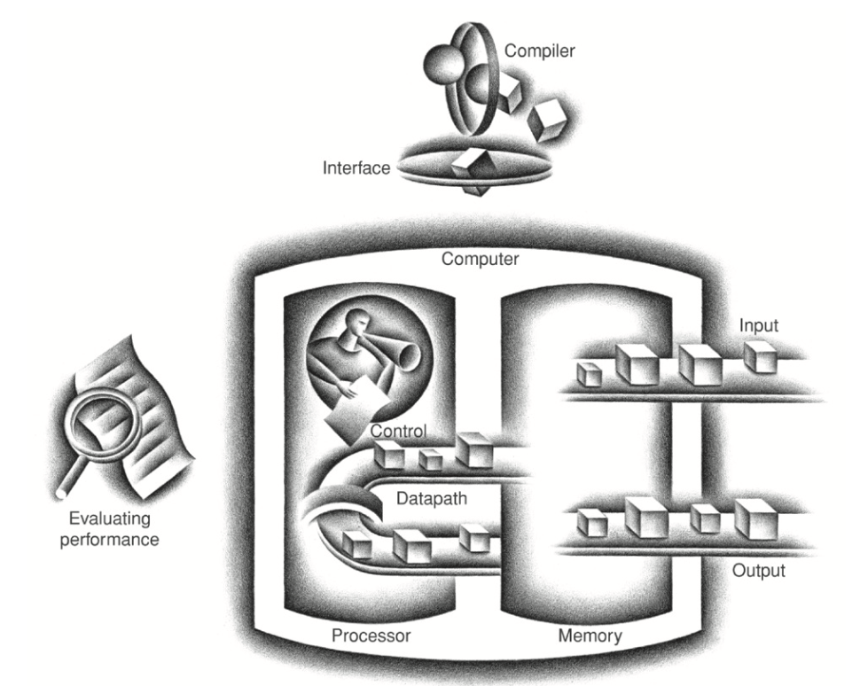

# Week 3: Basics of Computer Architecture  
*References: Patterson & Hennessy, ARM Edition, Chapter 1 (§1.1–§1.5)*  

---

## 1. Computer Architecture vs. Computer Organization (§1.1)  

When we talk about a computer’s design, it is important to separate two closely related but distinct ideas: **architecture** and **organization**.  

**Computer architecture** refers to the abstract model of the machine, the aspects that a programmer sees and interacts with. This includes the instruction set (the set of operations the computer can perform), the supported data types (integers, floating-point numbers, characters), the memory model, and the addressing modes. Architecture defines *what* the computer does, not *how* it is implemented.  
  - **Definition**: The conceptual design and fundamental operational structure of a computer system
  - Think, what the system **DOES** and how the user sees it -> The architecture of a computer is like a blueprint. You're buying a house -- know the rooms, the purpose of each room and the general layout. However, you don't know how the the builder will wire the house or the plumbing.  

**Computer organization**, on the other hand, describes the actual implementation of the architecture in hardware. This includes details such as the datapath (the circuits that carry out operations), control logic, pipeline structure, and the arrangement of memory and caches. Organization concerns *how* the machine performs the operations defined by the architecture.  
  - **Definition**: The operational units and their interconnections that implement the architectural specifications
  - Think, how the system is **BUILT** and how all of the hardware in the machine executes the architecture -> Lets go back to the construction analogy, this would be the other side of the coin. This would be the plumbing, wiring, and materials to build the house.

For example, the ARM architecture defines a particular instruction set. A simple ARM processor in a smartwatch and a powerful ARM-based processor in a smartphone both implement the same architecture, but their organizations differ drastically in clock speed, cache design, and power management.  

---

## 2. Major Components of a Computer System (§1.3)  

### Review

When we think about a typical application, this may be millions of lines of code but as we know, the hardware on a computer can only execute low level instructions in what we know as **machine code**. There are multiple layers of software that take us from this high level code to these lower level instructions. The two main system softwares that we'll focus on are the **Operating System**, (Linux, MacOS, Windows), and the **Compiler**. 
- **Operating System**: Interfaces user's programs and the hardware -> variety of different services and functions
- **Compilers**: Translate a program written in a high level language into instructions that the hardware can actually execute

Computers run on binary instructions, programming languages make these instructions easier to write and execute. Simple

### Hardware

A modern computer system can be understood as four interacting parts: the **CPU**, **memory**, **I/O devices**, and the **buses** that connect them.  



The **CPU (Central Processing Unit)** is the “brain” of the computer. It has two primary subsystems: the **control unit**, which directs the flow of instructions and data, and the **datapath**, which contains the arithmetic and logic unit (ALU) and registers. The ALU carries out basic operations such as addition, subtraction, and comparisons, while registers provide very small but extremely fast storage locations inside the CPU.  

The **memory hierarchy** organizes storage in layers, balancing speed and size. At the very top are **registers**, which are the fastest but also the smallest in capacity. Just below that are **caches**, small amounts of fast memory located close to the CPU to reduce the delay of accessing frequently used data. The next level is **main memory (RAM)**, which is larger but slower. Finally, **secondary storage** such as solid-state drives (SSDs) or hard drives provides massive capacity but at much lower speeds. This hierarchy exists because it is physically and economically impossible to build a single large, fast, cheap memory. By combining levels, systems achieve both speed and capacity.  

**I/O (Input/Output) devices** are the way the computer interacts with the outside world. Input devices include keyboards, mice, and sensors. Output devices include monitors, speakers, and printers. Storage devices and networking equipment are also part of the I/O system.  

Finally, these components communicate via **buses**, which are shared communication pathways that carry data, memory addresses, and control signals. Modern systems often use multiple buses internally to manage communication bottlenecks.  

---

## 3. Stored-Program Concept & Von Neumann Model (§1.2)  

One of the most important breakthroughs in computing was the **stored-program concept**, proposed by John von Neumann and colleagues in 1945 in the design of the EDVAC computer. The idea was simple but transformative: both instructions and data should be stored together in the same memory. This allowed the CPU to fetch instructions sequentially and made programs flexible; programs could be modified, moved, or even generated by other programs, since they were simply data in memory.  

The **Von Neumann architecture** built on this concept. It describes a computer model in which a single memory holds both instructions and data, and the CPU executes instructions sequentially from that memory. This model underlies virtually all modern general-purpose computers.  

However, the Von Neumann model introduces a limitation known as the **Von Neumann bottleneck**. Because both instructions and data share the same memory and bus system, the CPU cannot fetch an instruction and read or write data at the same time. As CPUs became faster, memory access became the limiting factor in overall performance.  

Some systems instead use the **Harvard architecture**, where instructions and data are stored in separate memories with separate access paths. This eliminates the bottleneck but increases hardware complexity. Harvard architectures are common in embedded systems such as microcontrollers, where efficiency and predictability are more important than flexibility.  

---

## 4. The Fetch–Decode–Execute Cycle (§1.4)  

At its core, the operation of every computer is governed by a repetitive loop known as the **fetch–decode–execute cycle**, sometimes simply called the **instruction cycle**. Regardless of the complexity of modern hardware, this cycle remains the heartbeat of the CPU, the rhythm by which all programs run.  

### 4.1 Fetch  

The first step is to **fetch** the next instruction from memory. The CPU maintains a special register called the **Program Counter (PC)**, which holds the memory address of the next instruction to be executed. The control unit sends this address over the address bus to main memory, which then returns the instruction’s binary code over the data bus. The instruction is placed into another register, often called the **Instruction Register (IR)**, where it can be decoded in the next step.  

Once the instruction is fetched, the program counter is usually incremented so that it points to the next instruction in memory. In the simplest case, instructions are stored sequentially, so adding one word length to the PC will point to the correct location. However, not all instructions follow sequential flow — control instructions such as branches, jumps, or function calls may change the PC to point to a different location, allowing the program to alter its path of execution.  

**Example:** Suppose the PC currently holds the address `0x00400000`. The CPU fetches the instruction at this location — for example, an “ADD R1, R2, R3” instruction. The PC is then incremented to `0x00400004` to prepare for the next instruction, assuming a 32-bit instruction size.  

### 4.2 Decode  

After the instruction has been fetched into the instruction register, the CPU must **decode** it to determine what action to perform. The binary pattern of the instruction is divided into fields, each of which has a specific meaning.  

One part of the instruction is the **opcode**, or operation code, which specifies what operation is to be carried out. Other parts of the instruction may specify the **source operands** (registers or memory addresses to be read) and the **destination operand** (where the result will be stored).  

Decoding is handled by the **control unit**, which translates the instruction’s binary fields into a set of control signals. These signals tell the datapath what to do: which registers to read, what operation the ALU should perform, whether memory should be accessed, and where the result should go.  

**Example:** If the instruction is “ADD R1, R2, R3,” the opcode specifies that this is an addition operation. The instruction also indicates that registers R2 and R3 should be read as inputs, and that the result should be written into R1. The control unit generates signals to fetch the values of R2 and R3, configure the ALU for addition, and prepare register R1 to receive the result.  

### 4.3 Execute  

The final stage is **execution**. In this step, the CPU performs the operation specified by the instruction. This may involve arithmetic in the ALU, accessing memory, or updating the program counter for a branch.  

- For arithmetic and logical instructions, the ALU performs the operation on the input operands.  
- For load or store instructions, the CPU interacts with memory: either reading data from memory into a register or writing data from a register into memory.  
- For branch or jump instructions, the program counter is updated with a new address, changing the flow of execution.  

The result of the instruction is then stored in the designated destination, typically a register or a memory location.  

**Example (continuing):** The ALU adds the values stored in R2 and R3. If R2 contains the number 7 and R3 contains the number 5, the ALU produces 12. This result is written into register R1. The PC has already been incremented, so the CPU is ready to fetch the next instruction.  

### 4.4 Cycle Repeats  

Once execution is complete, the cycle begins again: the CPU fetches the next instruction, decodes it, executes it, and so forth. This process continues for as long as the computer is powered on and running a program. Modern CPUs improve upon this basic model by overlapping multiple instructions (pipelining), executing instructions out of order, and using caches to speed up memory access. However, all of these optimizations are still based on the same fundamental fetch–decode–execute cycle.  

### 4.5 Importance  

Understanding the fetch–decode–execute cycle is key to understanding how software interacts with hardware. Every program you write in a high-level language is eventually broken down into instructions that pass through this cycle. From running a simple calculator application to rendering 3D graphics, the CPU is always fetching, decoding, and executing billions of instructions per second.  

---

## 5. RISC vs. CISC (Preview Only) (§1.1)  

Instruction sets come in two broad families: **RISC (Reduced Instruction Set Computer)** and **CISC (Complex Instruction Set Computer)**.  

**RISC architectures**, such as ARM, use a small set of simple instructions, each designed to execute quickly and usually in a single clock cycle. Instructions are fixed in length and follow a regular structure, which simplifies decoding and supports high-performance implementations like pipelining.  

**CISC architectures**, such as Intel’s x86, have large and varied instruction sets, with instructions that can perform complex operations. Instructions may vary in length, and some can execute multi-step operations in a single instruction. While this can make programs shorter, it complicates decoding and execution.  

Modern processors blur the line between RISC and CISC. For example, x86 processors often translate complex instructions internally into simpler micro-operations, similar to RISC instructions.  

For now, it is enough to understand that ARM is an example of RISC, and x86 is an example of CISC. The details of instruction sets will be covered later in the course.  

---

## 6. Basic Performance Metrics (§1.5)  


When evaluating computer systems, it is tempting to focus only on the processor’s clock speed, which is often advertised in gigahertz (GHz). The clock frequency tells us how many cycles the processor can execute per second. For example, a 3 GHz processor has a clock period of about 0.333 nanoseconds, meaning that its clock “ticks” three billion times per second. However, raw clock speed is not a complete measure of performance. Two different processors running at the same frequency, or even one running at a lower frequency, can complete a given task faster than another depending on their design and efficiency.  

To understand performance, computer architects use a fundamental equation that breaks down CPU execution time into three factors:  

```

CPU Time = Instruction Count × CPI × Clock Cycle Time

```

- The **Instruction Count (IC)** is the number of machine instructions executed for a given program. This depends on the instruction set architecture and also on the compiler, since different compilers may generate more or fewer instructions for the same source program.  
- The **Cycles Per Instruction (CPI)** is the average number of clock cycles each instruction requires to complete. CPI depends on the microarchitecture of the processor -> Simple instructions may take one cycle, while more complex instructions can take multiple cycles.  
- The **Clock Cycle Time** is the duration of a single cycle. It is the reciprocal of the clock frequency. A 2 GHz processor has a cycle time of 0.5 nanoseconds, while a 3 GHz processor has a cycle time of about 0.333 nanoseconds. 

For example, consider two processors:  

- Processor A: 3 GHz clock, average CPI = 2  
- Processor B: 2 GHz clock, average CPI = 1.2  

For each instruction, Processor A requires 0.666 ns (2 × 0.333 ns), while Processor B requires 0.6 ns (1.2 × 0.5 ns). Even though Processor B has a lower clock frequency, it executes each instruction faster because of its lower CPI. This example shows that clock speed alone does not determine performance.  

In practice, overall execution time also depends on the **instruction count**. A compiler that produces more efficient code may reduce the number of instructions, which can compensate for a higher CPI. Conversely, an instruction set with complex operations might reduce instruction count but increase CPI.  

Another useful metric is **MIPS (Millions of Instructions Per Second)**, which measures how many instructions a processor can execute per unit of time. However, MIPS can be misleading because instruction complexity varies across architectures. A program that executes fewer but more complex instructions may appear to have lower MIPS but still run faster.  

Modern benchmarks often measure performance using real-world applications or standardized test suites, because raw metrics like GHz or MIPS can be misleading on their own. Nonetheless, the CPU performance equation provides a valuable framework for understanding the trade-offs between instruction count, CPI, and clock speed.  

---

## 7. Summary and Transition  

This week introduced the big-picture view of computer architecture. We distinguished **architecture** (the abstract model) from **organization** (the implementation). We reviewed the major components of a computer system: CPU, memory, I/O, and buses. We discussed the **stored-program concept** and the **Von Neumann model**, including the bottleneck that arises from shared memory. We then examined the **fetch–decode–execute cycle**, the fundamental loop by which CPUs operate. Finally, we previewed the distinction between **RISC** and **CISC** architectures and introduced the **CPU performance equation** as a way of comparing processors.  

Next week, we will turn from this high-level view to the building blocks of processors: **logic gates, combinational circuits, and sequential logic**. These components show how the abstract concepts of architecture are realized in physical hardware.  

